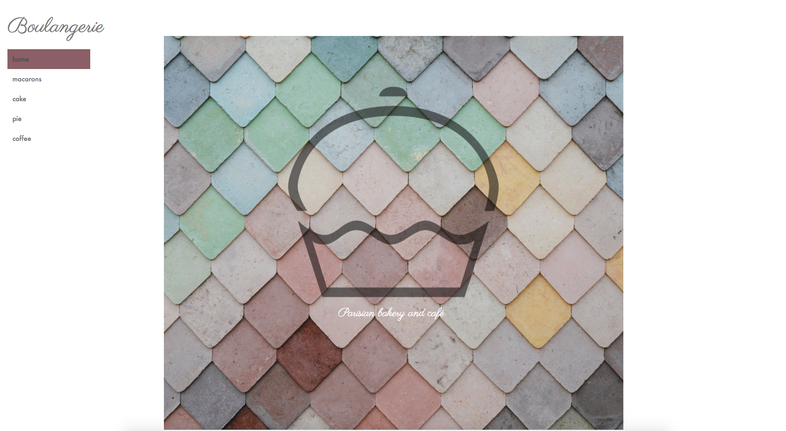
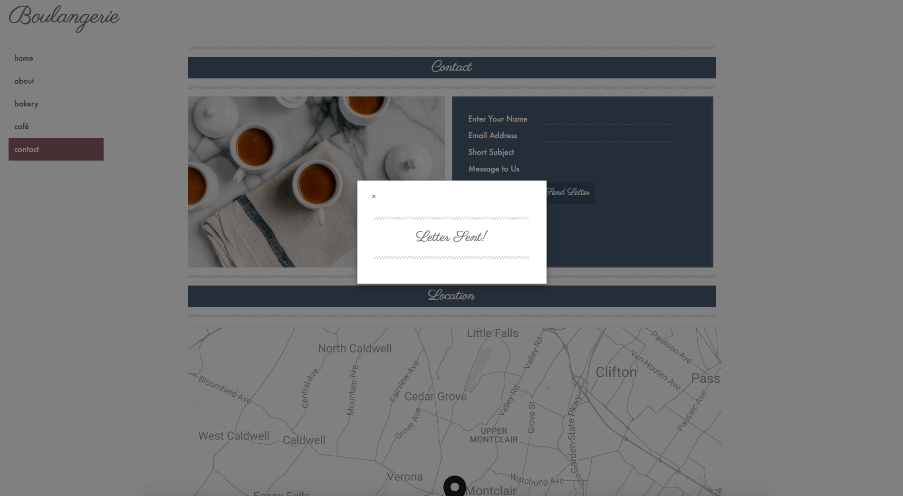

# Boulangerie
Full MEAN stack bakery proof of concept:
Users may view menus and submit an inquiry

## Technologies Used
* JavaScript
* AngularJS
* jQuery
* MongoDB
* Express.js
* Node.js
* HTML5
* CSS
* Bootstrap

## Why I created this application
To practice the MEAN stack while enhancing my HTML, CSS, Bootstrap, and general web design skills

### Contact View
Includes custom modal alert

